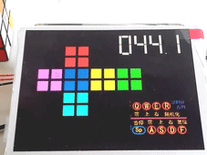
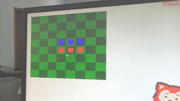

# Some FPGA Projects

* minicube is about playing an unfolded Rubik's Cube.

* othello is a platform for 2-players Reversi game.

* styx implements a MIPS CPU, and installed a ucosii. Program assembled to MIPS instructions can run on it.

